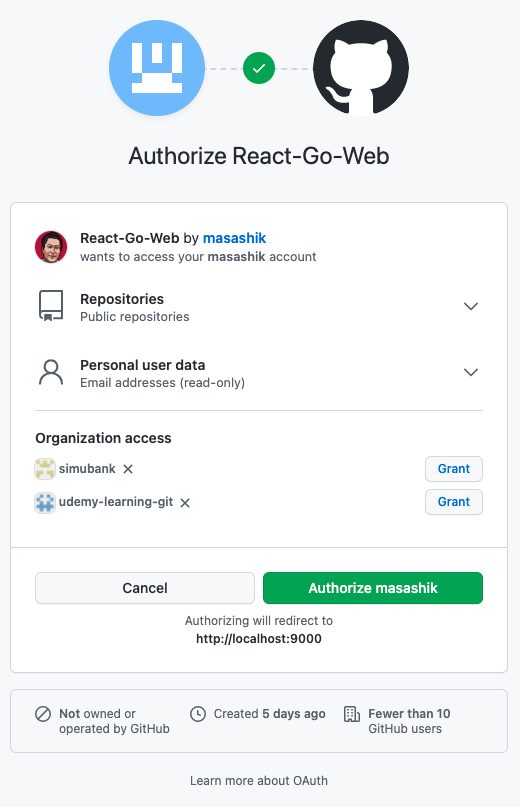

# react-go-web

[](https://github.com/masashik/react-go-web/actions/workflows/main.yml)

This is a Sign in with GitHub enabled front-end(JS) and back-end(Go) web app.

Step1         |  Step2      |  Step3      |
:-------------------------:|:------------------------:|:------------------------:|
   |    |  


# Get started

- Pick up your OS architecture and update Makefile.

```bash
#!/bin/bash

TERM=xterm

GOCMD=go
GOBUILD=GOOS=darwin $(GOCMD) build    #- GOOS=darwin for macOS
GOCLEAN=$(GOCMD) clean                #- GOOS=linux for Linux
GOTEST=$(GOCMD) test                  #- GOOS=windows for Windows
...
..
.
```


- Run the following make command in your terminal.
```shell
$ make all
```
- An executable binary (webapp) is created at the same directory of the Makefile.

```
LICENSE   Makefile  README.md go.mod    go.sum    main.go   static   ui   webapp
```

# Usage

## Option 1: Execute the binary with necessary environment variables in the same command line.
```
OAUTH_CLIENT_ID=xxxxxxxxxx OAUTH_CLIENT_SECRET=xxxxxxxxxx PORT=<PORT_NUM> ./webapp
```
- Open the browser and access to the running web app 
```
http://localhost:<PORT_NUM>
```

## Option 2: Create environment variable file in the same directory of the executable binary.
```shell
$ cat .env
OAUTH_CLIENT_ID=xxxxxxxxxx
OAUTH_CLIENT_SECRET=xxxxxxxxxx
PORT=<PORT_NUM>
$ ./webapp
```
- Open the browser and access to the running web app 
```
http://localhost:<PORT_NUM>
```


# TODO

- [ ] Add test scripts
- [ ] Containerize by Docker
